# Lenia.html — Beginner Guide to the Codebase

This guide explains the code structure of `Lenia.html` in a simple, step-by-step way so a beginner can quickly locate and understand the main parts of the project. It focuses on concrete flows, short explanations, and corrected diagrams.

## Contents

- Quick overview
- How to run (local)
- High-level flow (startup → step → render)
- Detailed function flows with diagrams and short pseudocode
- Short per-function reference (what to edit)
- Parameters summary
- Dataflow & FFT notes
- Glossary

## Quick overview

`Lenia.html` simulates a continuous 2D field that evolves over time. Main pieces:

- field array: the grid of values
- kernel: computes neighborhood influence (via convolution)
- delta: maps neighborhood influence to local growth
- main loop: apply kernel → delta → update → render

### Overall Simulation Flow (Visual)

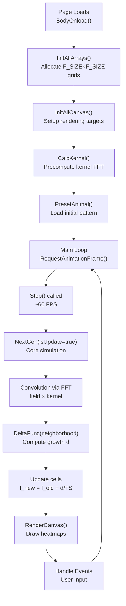

**One Simulation Cycle (Inner Loop Detail):**

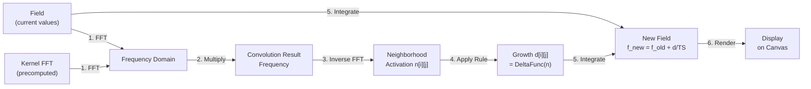

## Deep Function Reference — Core functions (parameters, data flow, side effects)

Below are step-by-step, detailed descriptions of the central functions. For each function you'll find:

- Purpose
- Parameters / arguments (if any)
- Global variables read (data sources)
- Global variables written (data mutated)
- What data it selects or computes
- Exact effect on the state (how it changes data)
- Short pseudocode summarizing the flow

Note: the codebase uses many global arrays (e.g. `field`, `kernelRe`, `neighRe`) — entries below list the main ones used.

### `InitAllArrays()` — **allocates all simulation arrays**

- Purpose: allocate and reset all simulation 2D arrays (buffers) to the current grid size `F_SIZE`. Think of this as "creating the memory for the simulation grid and all its working buffers."
- Parameters: none
- Globals read: `F_SIZE` (grid dimension, typically 256×256)
- Globals written (memory allocated):
  - `field` — main state array (the current population at each cell)
  - `fieldOld` — backup of previous generation (for non-destructive updates)
  - `fieldTx` — temporary buffer for transformations
  - `fieldIm` — imaginary part of field for FFT computation
  - `kernel` — spatial kernel visualization buffer
  - `kernelRe`, `kernelIm` — real and imaginary parts of frequency-domain kernel
  - `neighRe`, `neighIm` — real and imaginary buffers for neighborhood convolution
  - `delta` — growth per cell (delta function output)
  - `neigh` — neighborhood activation per cell
  
- Data allocation details:

  ```javascript
  for each array name in [field, fieldOld, fieldTx, fieldIm, kernel, kernelRe, kernelIm, neighRe, neighIm, delta, neigh]:
    allocate new Array(F_SIZE)
    for each row i in 0..F_SIZE-1:
      allocate row[i] as new Array(F_SIZE)
      fill row[i] with zeros: row[i].fill(0)
  PlotSurface(null)  // clear any previous plots
  ```
  
- Memory footprint:
  - Each array: F_SIZE × F_SIZE × 8 bytes (JavaScript float64) ≈ 512 KB per array
  - Total: ~11 arrays × 512 KB ≈ 5.6 MB for F_SIZE=256
  - Resizing requires complete reallocation (expensive operation, typically done only at startup)
  
- Impact:
  - Wipes out all previous state; any running simulation is lost
  - Usually called during initialization (`BodyOnload()`) or when user changes grid size
  - After this, must call `CalcKernel()` and `InitAllCanvas()` to rebuild kernel FFT and rendering targets
  - All arrays start at zero (empty grid)

### `InitAllCanvas()` — **prepares rendering targets and event listeners**

- Purpose:
  1. Create canvas DOM wrapper objects for each visible canvas element in the HTML
  2. Initialize 2D rendering contexts
  3. Set up canvas dimensions and coordinate tracking
  4. This function connects the HTML DOM to the JavaScript simulation
  
- Parameters: none
- Globals read: DOM elements with IDs `canvas1`, `canvas2`, `canvas3`, `canvas4`, `canvasT`
- Globals written: `canvas1`, `canvas2`, `canvas3`, `canvas4`, `canvasT` (canvas wrapper objects)
- What it does:

  ```javascript
  for each canvas id in ["canvas1", "canvas2", "canvas3", "canvas4", "canvasT"]:
    // Get the actual DOM canvas element
    domCanvas = document.getElementById(id)
    
    // Create a wrapper object with useful properties
    canvasWrapper = {
      can: domCanvas,                    // the actual DOM element
      ctx: domCanvas.getContext("2d"),   // 2D drawing context
      
      // Position tracking (for click coordinates)
      left: domCanvas.offsetLeft,
      top: domCanvas.offsetTop,
      
      // Dimension caching
      width: domCanvas.width,
      height: domCanvas.height
    }
    
    // Store wrapper globally
    canvas1/2/3/4/T = canvasWrapper
  ```
  
- Canvas layout (typical):
  - `canvas1`: Main field visualization (the creature display, usually upper-left)
  - `canvas2`: Neighborhood heatmap (how much influence neighbors have, upper-right)
  - `canvas3`: Delta heatmap (growth rate per cell, lower-left)
  - `canvas4`: Statistics/other metrics (lower-right)
  - `canvasT`: Control/UI text overlay canvas
  
- Impact:
  - Prepares rendering targets used by all drawing functions (`DrawField()`, `DrawAllPanels()`, etc.)
  - Called once during `BodyOnload()` initialization
  - Without this, all drawing functions would fail (no valid canvas context)

### `CalcKernel()` — **precomputes the neighborhood weighting in frequency domain**

- Purpose:
  1. Build the spatial kernel array `kernelRe` (the visual neighborhood shape)
  2. Compute its FFT to get `kernelRe` and `kernelIm` (frequency-domain kernel)
  3. Normalize by total weight so convolution weights are balanced
  
  This is called **once per parameter change** because FFT computation is expensive; the result is reused in every `NextGen()` call.

- Parameters: none
- Globals read:
  - `F_SIZE` (grid size, e.g., 256)
  - `NS` (kernel radius scale, e.g., 13 pixels)
  - `kernel_B[]`, `kernel_E[]`, `layerID`, `coreID`, `kernel_A` (all passed to `KernelFunc` to generate spatial shape)
  
- Globals written: `kernelRe`, `kernelIm` (frequency-domain kernel buffers), `kernel` (spatial kernel for visualization), `isKernelDrawn` (flag to redraw visualization)

- Detailed steps:

  **Step 1: Build spatial kernel (real space)**

  ```javascript
  weight = 0
  for i in 0..F_SIZE-1:
    for j in 0..F_SIZE-1:
      // Compute distance from center using periodic (toroidal) wrapping
      ii = (i < F_SIZE/2) ? i : i - F_SIZE  // handle wrap-around
      jj = (j < F_SIZE/2) ? j : j - F_SIZE
      
      // Normalized radius: [0, ∞) scaled by kernel size
      r = sqrt(ii^2 + jj^2) / NS  // NS ≈ 13 pixels → normalized to [0,1] at kernel edge
      
      // Get layer-weighted kernel value from KernelFunc
      v = KernelFunc(r)  // returns [0,1] typically
      
      // Accumulate total weight (used for normalization later)
      weight += v
      
      // Store spatial kernel value
      kernelRe[i][j] = v
      kernel[mirror_index] = v  // mirror for visualization (flipped quadrants)
  ```
  
  Result: `kernelRe[i][j]` now contains the spatial kernel—a 2D "hump" showing how much each neighbor contributes based on distance. Values near the center are high (~1.0), falling off to 0 at the edges.

  **Step 2: Transform kernel to frequency domain (Fourier space)**

  ```javascript
  // Initialize imaginary part to zero
  for i: kernelIm[i].fill(0)
  
  // Compute 2D FFT: spatial kernel → frequency kernel
  FFT2D(1, kernelRe, kernelIm)
  ```
  
  Result: `kernelRe` and `kernelIm` now contain H(ω_x, ω_y), the frequency-domain kernel. This is why convolution is fast: pointwise multiply in frequency domain is O(N²), vs. O(N⁴) convolution in spatial domain.
  
  **Step 3: Normalize by total weight**

  ```javascript
  for i,j:
    kernelRe[i][j] /= weight
    kernelIm[i][j] /= weight
  ```
  
  Why: ensures that a uniform field (all cells = 1.0) convolves to approximately 1.0 (no artificial amplification). Without normalization, total neighborhood activation could be > 1.0, breaking delta function calibration.

- Impact:
  - Called once during initialization and once per parameter change (expensive)
  - Reused in **every** `NextGen()` call via `MatrixDot()` for convolution
  - Changes to `kernel_B[]`, `kernel_E[]`, `layerID`, `coreID`, `kernel_A` all trigger `CalcKernel()` automatically
  - Different kernel shapes (single-ring vs. multi-ring, gaussian vs. polynomial) dramatically alter neighbor weighting and thus lifeform behavior
  - `isKernelDrawn = false` — marks the spatial kernel visualization as needing redraw

**Impact:** `kernelRe`/`kernelIm` now contain the frequency-domain kernel used by `NextGen`'s convolution step. Recomputing this per parameter change is expensive — only do when kernel params change.

### `NextGen(isUpdate)` — core simulation step (called by `Step()`)

- Purpose: compute one generation: convolution, delta mapping, and field update. This is the **heart of the simulation**.
- Parameters: `isUpdate` (boolean; when false, compute neighbors/delta but do not update `field` — useful for preview/analysis)
- Globals read: `field` (current state array F_SIZE×F_SIZE), `kernelRe`/`kernelIm` (precomputed kernel in frequency domain), `F_SIZE` (grid size), `TS` (time steps per unit), `delta_c`/`delta_w` (delta function parameters), `isLimitValue` (whether to cap field at 1), `optCenter` (auto-centering mode), `mX`/`mY` (centroid for centering)
- Globals written: `fieldOld` (backup copy), `fieldIm` (imaginary FFT buffer), `neighRe`/`neighIm` (frequency domain buffers), `neigh` (neighborhood activation), `delta` (growth per cell), `field` (updated state if isUpdate=true), `gen`, `runGen`, `time`, `transA`, `transS`

**Visual Data Flow (One Generation Cycle):**

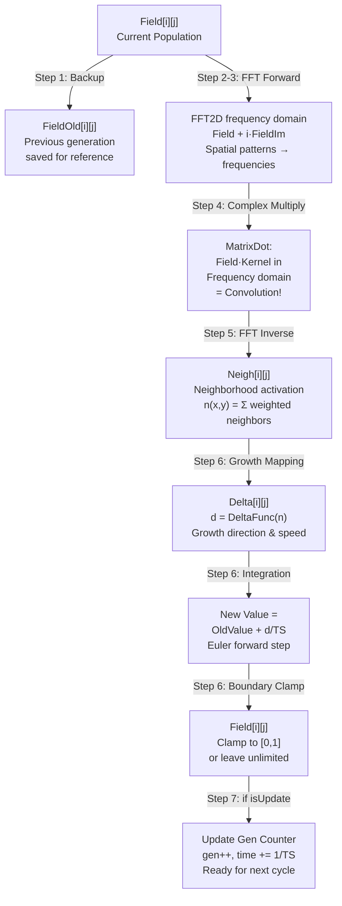

- Detailed steps and data transformations:

  **Step 1: Preserve old field**

  ```javascript
  for each cell (i,j) from 0 to F_SIZE-1:
    fieldOld[i][j] = field[i][j]
  ```

  Why: we need to read the old values while computing the update; this prevents overwriting before reading.
  
  **Step 2: Initialize imaginary buffer to zero**

  ```javascript
  for each row i: fieldIm[i].fill(0)
  ```

  Why: the field values are initially real; to use FFT we treat them as complex with 0 imaginary part.
  
  **Step 3: Forward FFT (spatial → frequency domain)**

  ```javascript
  FFT2D(1, field, fieldIm)
  ```

  What happens: `field` now contains the real part of F(ω_x, ω_y), `fieldIm` the imaginary part. This converts spatial neighborhood patterns to frequency components.
  
  **Step 4: Frequency-domain multiplication (convolution)**

  ```javascript
  MatrixDot(field, fieldIm, kernelRe, kernelIm, neighRe, neighIm)
  ```

  What this does: performs element-wise complex multiplication: (field + i·fieldIm) × (kernelRe + i·kernelIm) → (neighRe + i·neighIm). Mathematically, this is the FFT of the convolution k∗f.
  
  **Step 5: Inverse FFT (frequency → spatial domain)**

  ```javascript
  FFT2D(-1, neighRe, neighIm)
  ```

  What happens: neighRe now contains the spatial-domain neighborhood activation n(x,y) = k∗f(x,y). This value represents the "local influence" at each cell — how much of its neighbors affect it.
  
  **Step 6: Update each cell based on neighborhood and growth**

  ```javascript
  for i from 0 to F_SIZE-1:
    for j from 0 to F_SIZE-1:
      // A. Extract neighborhood activation for this cell
      //    neighRe[i][j] contains the sum of weighted neighbors from FFT convolution
      n = neighRe[i][j]  
      
      //    This value is typically in [0, 1] but can exceed 1 if neighbors are overlapping
      //    High n → many neighbors active (crowded, good conditions)
      //    Low n → few neighbors active (isolated, poor conditions)
      //    Interpretation depends on delta function tuning
      
      // B. Compute target growth direction using delta function
      d = DeltaFunc(n)
      //    d = +1: cell should grow maximally (optimal neighborhood)
      //    d = 0: cell at equilibrium (no change)
      //    d = -1: cell should shrink maximally (bad neighborhood)
      //    |d| controls speed of change
      
      // C. Retrieve old cell value to compute change
      old_value = fieldOld[i][j]  // [0, 1] typically
      //    This is f(i,j,t) — the cell's value at previous generation
      
      // D. Apply Euler integration to advance time
      //    dy/dt = d  (growth equation)
      //    y(t+Δt) ≈ y(t) + (dy/dt) × Δt
      //    With Δt = 1/TS, we get:
      growth_amount = d / TS
      new_value = old_value + growth_amount
      
      //    Example: if d=0.5, TS=20, old_value=0.3
      //             growth_amount = 0.5/20 = 0.025
      //             new_value = 0.3 + 0.025 = 0.325
      //    The larger TS (more time steps), the slower the change per generation
      //    Smaller TS = faster evolution (fewer substeps per visible generation)
      
      // E. Apply boundary constraints
      if (new_value < 0): new_value = 0           // can't go negative
      if (isLimitValue && new_value > 1): new_value = 1  // cap at 1 if limited mode
      // else: unlimited mode allows new_value > 1 (can overgrow)
      
      //    isLimitValue flag determines simulation mode:
      //    - TRUE: field values clamped to [0,1] (bounded population)
      //    - FALSE: values can exceed 1 (unbounded growth possible)
      
      // F. Store results in visualization arrays for UI
      neigh[i][j] = n        // for heatmap display
      delta[i][j] = d        // for growth heatmap display
      
      // G. Update field if requested
      if (isUpdate):
        field[i][j] = new_value  // commit the change
      // else: preview mode, don't actually modify field
      
      // H. Apply optional centering (auto-track creature centroid)
      if (optCenter != Center_OFF):
        // Shift to keep creature centered in display
        ii = Mod(i - mY_shifted, F_SIZE)
        jj = Mod(j - mX_shifted, F_SIZE)
        // Results stored in shifted arrays for rendering
  ```
  
  Key insight: **each cell's fate depends on three things**:
  1. Its current value (old_value) — history/momentum
  2. Its neighborhood activation (n) — external influence
  3. The growth profile (d) — the rule defining "life"
  
  Together: new_value = old_value + (rule(neighborhood) / time_steps)
  What this does: for **each of the F_SIZE² cells**, we:
  - Extract the neighborhood activation computed by FFT convolution
  - Apply the delta function to map neighborhood → growth
  - Update the cell value as: f_new = f_old + (growth / time_steps)
  - Clamp to keep values in valid range [0, 1] or [0, ∞)

  **Step 7: Update counters**

  ```javascript
  if (isUpdate):
    gen++                    // increment generation counter
    if (runGen != null):
      runGen--               // decrement run limit if active
    time += 1/TS             // advance simulation time
    transA = null            // clear rotation transient
    transS = null            // clear scale transient
  ```
  
- Pseudocode (compact):

```javascript
function NextGen(isUpdate):
  // Preserve state
  for i,j: fieldOld[i][j] = field[i][j]
  zero fieldIm
  
  // Convolution via FFT
  FFT2D(1, field, fieldIm)
  MatrixDot(field, fieldIm, kernelRe, kernelIm, neighRe, neighIm)
  FFT2D(-1, neighRe, neighIm)
  
  // Compute new state per cell
  for i,j:
    ii,jj = compute possibly shifted indices
    n = neigh[ii][jj] = neighRe[i][j]
    d = delta[ii][jj] = DeltaFunc(n)
    v = fieldOld[i][j] + d / TS
    v = clamp(v, 0, isLimitValue ? 1 : ∞)
    if (isUpdate) field[ii][jj] = v
  
  // Update simulation counters
  if isUpdate:
    gen++, time += 1/TS
    if runGen set: runGen--
    clear transients
```

Impact: **`field` becomes the new simulation state**. The arrays `neigh` and `delta` are now populated and available to rendering functions and statistics calculators. This single function is where the entire dynamics happen — change how NextGen works and you change the entire simulation behavior.

### `DeltaFunc(n)` — **defines what "life" is**

- Purpose: map neighborhood activation `n` (a scalar from 0 to ~1) to a growth value `d` using one of several profiles. **This function defines what "life" means in your simulation by determining when cells grow, stay stable, or die.**
- Parameters: single scalar `n` (neighborhood activation at a single cell, typically in [0,1] but can be higher)
- Globals read: `deltaID` (which formula to use: 0=gaussian, 1=polynomial, 2=trapezoid, 3=step), `delta_c` (μ - center/peak of the growth curve), `delta_w` (σ - width/spread of the curve), `kernel_A` (power/stiffness exponent for polynomial modes)
- Globals written: none (pure mathematical function with no side effects)

**Visual Growth Profiles (how neighborhood influences growth):**

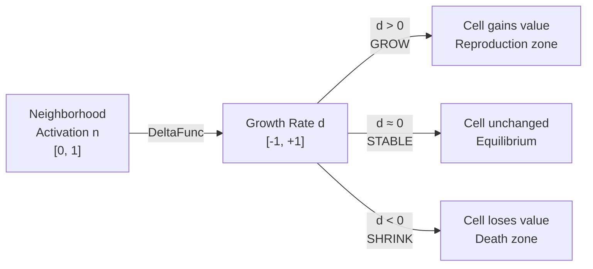

**Delta Profile Comparison (Visual Comparison of All 4 Cases):**

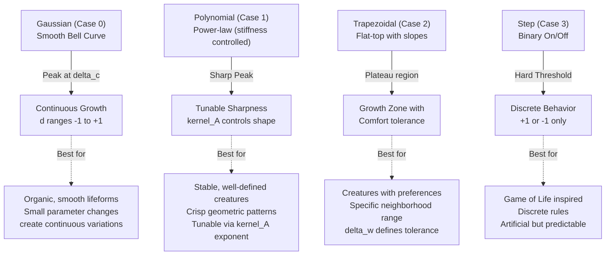

**Delta Profile Curve Comparison (Mathematical Shapes):**

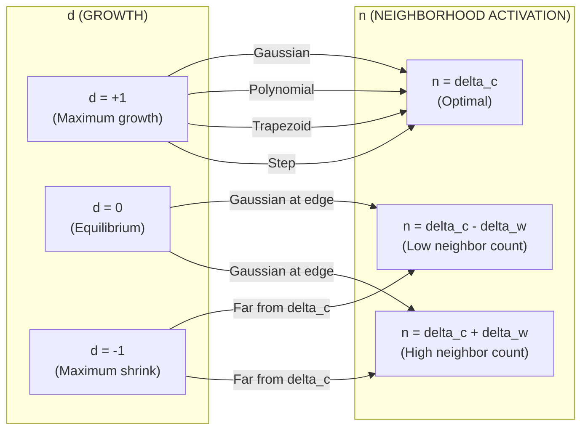

- Selects data: uses `deltaID` to choose one of four delta profiles:

  **Case 0: Gaussian-like (smooth bell curve)**

  ```javascript
  r = abs(n - delta_c)
  return 2 * exp(-r^2 / (2 * delta_w^2)) - 1
  
  Shape: smooth bell curve ranging from -1 to +1
  - Peaks at d = +1 when n = delta_c (optimal neighborhood value)
  - Decays smoothly as n diverges from delta_c
  - When n is far from delta_c, returns negative (d < 0, cell shrinks)
  Effect: cells grow when neighborhood is near delta_c; die when far away
  Use case: smooth, natural, continuous life forms; most "organic" creatures
  Example: delta_c=0.3, delta_w=0.1 means cells thrive when ~30% of neighbors are active
  ```
  
  **Case 1: Polynomial (power-law variant with stiffness control)**

  ```javascript
  r = abs(n - delta_c)
  if r^2 > (3*delta_w)^2: return -1  // hard boundary
  return (1 - r^2/(9*delta_w^2))^kernel_A * 2 - 1
  
  Shape: controlled by kernel_A exponent
  - kernel_A = 1: smooth parabola
  - kernel_A = 2: more peaked
  - kernel_A = 4: very sharp peak with steep sides
  Effect: sharper transitions than gaussian; peak is more plateau-like with higher kernel_A
  Use case: crisp boundaries, stable geometric creatures, more "discrete" behavior
  ```
  
  **Case 2: Trapezoidal (flat-top with ramped edges)**

  ```javascript
  r = abs(n - delta_c)
  p = delta_w / 2    // inner half-width (comfort zone)
  q = delta_w * 2    // outer half-width (tolerance edge)
  if r <= p: return 1           // flat growth plateau
  if p < r <= q: return (q-r)/(q-p) * 2 - 1  // linear slope to zero
  else: return -1               // outside tolerance (decay)
  
  Shape: flat-top plateau with linear ramp down
  - Cells grow maximally for n in [delta_c-p, delta_c+p] (comfort zone)
  - Gradual transition in [p, q] range
  - Sharp decay outside [q, ∞]
  Effect: cells have a specific "comfort zone" and can tolerate deviation
  Use case: creatures with specific neighborhood requirements; more stable patterns
  ```
  
  **Case 3: Step (binary on/off threshold)**

  ```javascript
  r = abs(n - delta_c)
  if r <= delta_w: return 1
  else: return -1
  
  Shape: binary; either +1 (growth) or -1 (decay), no gradation
  Effect: sharp threshold; all or nothing dynamics
  Use case: Game of Life-like rules (discrete, rule-based); simplest logic
  ```

- Return value: scalar `d` in range [-1, 1]
  - `d > 0`: cell **grows** (increases in value, reproduces)
  - `d = 0`: cell **stable** (no change, equilibrium at threshold)
  - `d < 0`: cell **shrinks** (decreases in value, dies off)
  - Magnitude `|d|` indicates **speed**: larger `|d|` → faster growth/decay per generation

- Data flow example:
  - Input neighborhood activation n = 0.35 (35% of neighbors active after convolution)
  - Parameters: deltaID=0, delta_c=0.3, delta_w=0.08
  - Calculation: r = |0.35 - 0.3| = 0.05, return 2*exp(-(0.05)^2/(2*0.08^2)) - 1 ≈ 1.8 - 1 = 0.8
  - Cell grows with rate d = 0.8 (80% of maximum growth speed)

- Impact: **tiny changes to `delta_c` or `delta_w` dramatically shift the entire life/death dynamics**. This is the PRIMARY tuning parameter to discover new lifeforms. Sweeping `delta_c` in steps of 0.05 across [0.1, 0.9] and `delta_w` similarly creates thousands of distinct rule variants—the vast "parameter space" of possible creatures.

### `KernelFunc(r)` and `CoreFunc(r)` — **determines which neighbors matter and how much**

- Purpose: `KernelFunc(r)` returns the radial kernel value (weighting factor) at distance `r` from a cell. For simple kernels, `KernelFunc = CoreFunc` directly. For multi-layer kernels, `KernelFunc` composes multiple `CoreFunc` calls with layer weights to create concentric rings of influence around each cell.
- Parameters: `r` (normalized radius, where 0 ≤ r ≤ 1 represents one kernel radius)
- Globals read:
  - `layerID` (0 = unimodal single ring, 1 = bimodal two rings, 2 = trimodal three rings, 3 = tetramodal four rings)
  - `kernel_B[]` (peak/trough weights for each layer, array of up to 4 values)
  - `kernel_E[]` (valley/edge weights between layers)
  - `B_DIV` (denominator for normalization, typically 12)
  - `coreID` (which core function shape: 0=bump, 1=polynomial, 2=trapezoid, 3=step, 4=life-like)
  - `kernel_A` (power/stiffness exponent for polynomial core functions)
- How it works—two paths:

  **Path 1: Unimodal kernel (layerID == 0)**

  ```javascript
  if layerID == 0:
    return CoreFunc(abs(r))  // single radial bell curve, simple
  ```

  Direct: returns a single smooth bump centered at r=0.5
  
  **Path 2: Multi-layer kernel (layerID > 0)** — creates concentric rings

  ```javascript
  if r >= 1: return 0  // outside all rings, no influence
  
  // Map the normalized radius [0,1] to layer space
  R = r * (layerID + 1)  // "zoom in" to reveal layer structure
  // Examples with layerID=2 (trimodal, 3 rings):
  //   r=0.1 → R=0.3  (inner ring, layer 0)
  //   r=0.4 → R=1.2  (middle ring, layer 1)
  //   r=0.9 → R=2.7  (outer ring, layer 2)
  
  b = floor(R)           // which layer are we in? (0, 1, 2, ...)
  e = floor(R + 0.5)     // neighboring layer for interpolation
  
  // Fetch layer weight, or 0 if beyond available layers
  kE = (e <= layerID) ? kernel_E[e] : 0
  
  // Combine core function shape with layer weights
  // kernel_B[b] = peak weight for this layer
  // kernel_E[e] = valley/edge weight 
  // B_DIV = normalization constant
  return CoreFunc(R % 1) * (kernel_B[b] - kE) / B_DIV + kE / B_DIV
  ```
  
  **Example: Bimodal kernel (layerID=1) creates two rings:**
  - r ∈ [0, 0.5]: layer 0 (inner ring), weight = kernel_B[0]
  - r ∈ [0.5, 1]: layer 1 (outer ring), weight = kernel_B[1]
  - Each ring's shape is defined by `CoreFunc`, height by `kernel_B`
  - Result: cell "senses" both nearby and distant neighbors with different weights

- `CoreFunc(r)` — selects one of several radial shapes (applied within each ring):

  **Case 0: Gaussian bump**
  - Formula: $\mathrm{Core}(r)=\exp\bigl(\alpha\bigl(1 - \frac{1}{4r(1-r)}\bigr)\bigr)$
  - Shape: smooth, natural bell curve; heaviest at $r=0.5$, symmetric falloff.
  - Parameter: $\alpha$ (from `kernel_A`) controls peak curvature.
  - Use: organic, smooth creatures; biologically realistic behavior.

  **Case 1: Polynomial**
  - Formula: $\mathrm{Core}(r)=(4r(1-r))^{\alpha}$
  - Shape: power-law; $\alpha$ controls sharpness of the peak ($\alpha=1$ broad, larger $\alpha$ sharper).
  - Use: stable, well-defined geometric structures; tunable sharpness.

  **Case 2: Trapezoidal**
  - Description: flat inner region (comfort zone) transitioning linearly to zero at edges.
  - Typical inner region: $r \in [0.25, 0.75]$ (implementation may vary by kernel scaling).
  - Use: disc-like, blocky creatures with clearer boundaries.

  **Case 3: Step**
  - Description: binary kernel: value 1 up to a threshold radius $r_{th}$, then 0 beyond.
  - Use: discrete, box-shaped neighborhoods (artificial but useful for experiments).

  **Case 4: Life-like**
  - Description: a custom core used for Life-like variants; may combine plateau and bumps to emulate classical CA neighborhoods.
  - Special weights: high at $r=0$ (self), ring at $r \approx 0.7$, sparse beyond.
  - Use: mimics Conway's Game of Life neighborhoods; when reproducing specific Game-of-Life-like behavior in continuous fields.

  **Implementation note:** all core functions are evaluated on the normalized ring coordinate (usually in $[0,1]$) and scaled/combined by `kernel_B` and `kernel_E` in `KernelFunc()` to produce the final radial weighting.

- Impact: `KernelFunc` **determines what "neighbors" matter and with what strength**. Changing the kernel shape and multi-layer structure changes spatial interactions:
  - Single-ring kernel: cell responds to neighborhood at one distance (localized)
  - Multi-ring kernel: cell can "sense" both close and distant neighbors (long-range effects possible)
  - Different `coreID` shapes: Gaussian = organic; polynomial = sharp; trapezoid = boxy; step = discrete
  - Adjusting `kernel_B[]` weights creates exotic behaviors like oscillations or traveling waves

### `MatrixDot(ar, ai, br, bi, cr, ci)` — **complex multiplication in frequency domain**

- Purpose: complex pointwise multiplication (frequency-domain multiplication) of two complex 2D arrays: (ar + i ai) * (br + i bi) -> (cr + i ci). This implements the convolution theorem: multiply in frequency domain = convolve in spatial domain.

**Visual: How Convolution Works (Frequency Domain)**

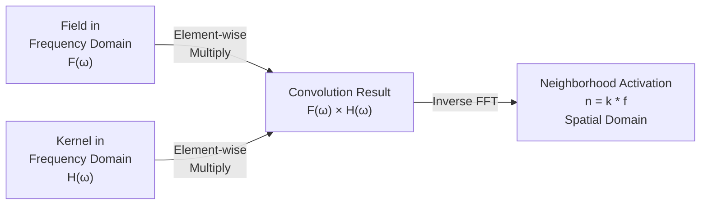

**Complex Number Multiplication Formula:**

```
(a + ib) × (c + id) = (ac - bd) + i(ad + bc)

For efficiency, we compute with fewer multiplications:
  t = a(c + d)
  cr[i][j] = t - d(a+b)    // real part: ac - bd
  ci[i][j] = t + c(b-a)    // imag part: ad + bc
  
This reduces 4 multiplications to 3 (Karatsuba algorithm)
```

- Parameters: references to 2D arrays `ar`, `ai`, `br`, `bi`, and output arrays `cr`, `ci`
- Globals read: none (uses provided arrays)
- Globals written: `cr`, `ci`
- Operation detail: uses algebraic rearrangement to minimize temporaries; computes element-wise multiplication for each index
- Pseudocode:

```javascript
for i in 0..S-1:
  for j in 0..S-1:
    a = ar[i][j]; b = ai[i][j]; c = br[i][j]; d = bi[i][j]
    t = a * (c + d)
    cr[i][j] = t - d*(a+b)         // (ac - bd)
    ci[i][j] = t + c*(b-a)         // (ad + bc)
```

- Mathematical insight (Convolution Theorem):

  ```
  Spatial domain convolution: n(x,y) = ∫∫ k(x',y') × f(x-x',y-y') dx' dy'
  Frequency domain: N(ω_x, ω_y) = K(ω_x, ω_y) × F(ω_x, ω_y)   [pointwise multiply!]
  
  This is WHY FFT makes convolution fast:
  - Spatial: O(K_size²) multiply-add per output point = O(N² × K²)
  - Frequency: O(1) multiply per point after FFT = O(N² log N + N²)
  - Speedup for N=256, K=32: 65536 ops → ~2000 ops (30× faster)
  ```

Impact: `MatrixDot` produces the frequency-domain product that yields convolution after inverse FFT.

### `FFT1D(dir, re1, im1)` — **efficient 1D Fast Fourier Transform**

- Purpose: compute the 1D FFT using Cooley-Tukey algorithm. Converts 1D signal from spatial domain to frequency domain (forward) or vice versa (inverse). Used as building block for 2D FFT.
- Parameters:
  - `dir` (1 = forward spatial→frequency, -1 = inverse frequency→spatial)
  - `re1` (1D array of real parts, length must be power of 2)
  - `im1` (1D array of imaginary parts, same length)
  
- How it works (high-level):

  ```javascript
  function FFT1D(dir, re1, im1):
    N = re1.length  // must be power of 2 (256, 512, etc.)
    
    // Step 1: Bit-reversal permutation (reorder input)
    // Rearrange elements so that indices are reversed bitwise
    // E.g., for N=8: 0→0, 1→4, 2→2, 3→6, 4→1, 5→5, 6→3, 7→7
    for i = 0 to N-1:
      j = bitReverse(i)  // reverse the binary representation
      if (j > i):        // only swap once
        swap re1[i] ↔ re1[j]
        swap im1[i] ↔ im1[j]
    
    // Step 2: Iterative Danielson-Lanczos butterfly operations
    // Process in stages, doubling the "span" each stage
    // Stage 1: process pairs (span=2)
    // Stage 2: process quads (span=4)
    // ... until span=N
    
    stepSize = 2
    while stepSize <= N:
      // Compute twiddle factor: exp(dir * 2π*i / stepSize)
      angle = dir * 2π / stepSize
      
      for start = 0 to stepSize/2-1:
        // Compute twiddle factor for this offset
        w_real = cos(angle * start)
        w_imag = sin(angle * start)
        
        for i = start to N-1 step stepSize:
          j = i + stepSize/2
          
          // Complex multiply: (re[j] + i·im[j]) * (w_real + i·w_imag)
          t_real = re[j] * w_real - im[j] * w_imag
          t_imag = re[j] * w_imag + im[j] * w_real
          
          // Butterfly: combine elements
          re[j] = re[i] - t_real
          im[j] = im[i] - t_imag
          re[i] += t_real
          im[i] += t_imag
      
      stepSize *= 2
    
    // Step 3: Normalize inverse transform (forward doesn't normalize)
    if dir == -1:
      for i = 0 to N-1:
        re1[i] /= N
        im1[i] /= N
  ```
  
- Performance: O(N log N) complexity vs. O(N²) naive DFT; for N=256, this is 2048 operations vs. 65536
- Output data: `re1` and `im1` are modified in-place; contain frequency-domain or spatial-domain result depending on `dir`

### `FFT2D(dir, re2, im2)` — **efficient 2D Fast Fourier Transform (for convolution)**

- Purpose: compute 2D FFT by decomposing into two passes of 1D FFT (one row-wise, one column-wise). This is the Fourier transform used in `NextGen()` for neighborhood convolution.
- Parameters:
  - `dir` (1 = forward, -1 = inverse)
  - `re2`, `im2` (2D arrays, dimensions must be powers of 2)

**Visual Data Flow (2D FFT Process):**

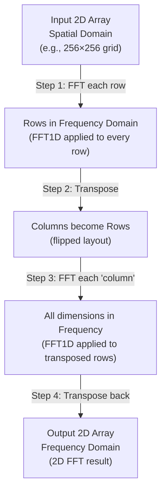

**Why This Works (Separability):**

2D FFT can be decomposed:

- F(u,v) = [1D-FFT across x-axis] → [1D-FFT across y-axis]
  
Because the 2D Fourier transform equation factors:

- F(u,v) = Σ Σ f(x,y) · e^(-2πi(ux+vy))
- = [Σ e^(-2πiux)] · [Σ e^(-2πivy)]

So we can do:

1. FFT each row (transforms x-dimension to frequency u)
2. Transpose (now columns are 1D)
3. FFT each row again (transforms y-dimension to frequency v)
4. Transpose back (restore layout)

- How it works (row-then-column decomposition):

```javascript
function FFT2D(dir, re2, im2):
  // Step 1: Apply 1D FFT to each ROW independently
  for each row i in 0..H-1:
    FFT1D(dir, re2[i], im2[i])
  // After this: each row is now in frequency domain
  
  // Step 2: Transpose the matrix (swap rows ↔ columns)
  Transpose(re2)
  Transpose(im2)
  
  // Step 3: Apply 1D FFT to each column (which is now a row after transpose)
  for each row i in 0..W-1:
    FFT1D(dir, re2[i], im2[i])
  
  // Step 4: Transpose back to restore original layout
  Transpose(re2)
  Transpose(im2)
  // Now we have the 2D FFT result
```
  
- Performance analysis:
  - **Naive 2D FFT**: O(N⁴) — 256² × 256² ≈ 4 billion operations
  - **Separable 2D FFT**: O(N² log N) — 256² × log(256) ≈ 524 thousand operations
  - **Speedup**: ~10,000× faster by using separability
  
- Example data flow (256×256 grid):
  - Input: spatial field with creature pattern
  - After Step 1: each row transformed to frequency components (horizontal frequencies)
  - After Step 3: frequency domain showing all spatial frequencies present
  - Can multiply with kernel frequency domain (convolution theorem)
  - Inverse FFT: back to spatial domain with convolution result
  
- Common mistakes:
  - Forgetting the second transpose (result will be transposed!)
  - Not handling normalization on inverse (output magnitude will be wrong)
  - Dimension mismatch or not padding to power-of-2 size
  
- Normalization:
  - Forward FFT (dir=1): no scaling (output can be large)
  - Inverse FFT (dir=-1): scales by 1/(N²) to restore magnitude
  - This preserves energy and prevents accumulation errors

### `MatrixDot(re1, im1, re2, im2, re3, im3)` — **complex multiplication in frequency domain**

- Purpose: multiply two complex numbers represented as 2D arrays element-wise. This implements the convolution theorem: pointwise multiply in frequency domain ≈ convolution in spatial domain.
- Used in: `NextGen()` after FFT, to apply the kernel to the field
- Data flow:

  ```javascript
  Input: 
    re1 + i·im1  (field in frequency domain)
    re2 + i·im2  (kernel in frequency domain)
  Output: re3 + i·im3  (product in frequency domain, ready for inverse FFT)
  
  For each element (i,j):
    (a + ib) × (c + id) = (ac - bd) + i(ad + bc)
    
    re3[i][j] = re1[i][j] * re2[i][j] - im1[i][j] * im2[i][j]
    im3[i][j] = re1[i][j] * im2[i][j] + im1[i][j] * re2[i][j]
  ```

Impact: allows fast convolution computation; the core speedup enabling real-time simulation of large grids.

### `Step()` — animation frame callback (runs ~60 fps)

- Purpose: main per-frame dispatcher; checks for user input, runs simulation steps if running, updates display, and requests next frame.
- Parameters: none
- Globals read: `actionKey`, `actionShift`, `isRunning`, `isRunOnce`, `optGIF`, `gen`, `runGen`
- Globals written: `actionKey`, `actionShift`, `isRunOnce`, `fps` (via `CalcFPS()`)
- Flow:
  1. If `actionKey` is set, call `DoAction(actionKey, actionShift)` and clear the key
  2. If `isRunning` or `isRunOnce`:
     - Call `CalcFPS()` to update frames-per-second counter
     - Call `NextGen()` to advance simulation by one step
     - Call `CalcMoments()` to compute statistics and invariants
     - Call `CalcPeriods()` to detect period cycles
     - Call `CalcStats()` to update stat arrays for graphing
     - Call `DrawStatsBar()` and `DrawAllPanels()` to render all canvases
     - Call `ShowCounters()` to update UI labels (generation count, time, FPS)
     - If `optGIF==GIF_ON` append current frame to GIF buffer
     - If `runGen` was set and reaches 0, clear `runGen` and stop running
  3. Clear `isRunOnce` flag
  4. Request next animation frame via `window.requestAnimationFrame(Step)`
- Pseudocode:

```javascript
function Step():
  if actionKey: DoAction(actionKey, actionShift); clear actionKey
  if isRunning or isRunOnce:
    CalcFPS()
    NextGen()
    CalcMoments()
    CalcPeriods()
    CalcStats()
    DrawStatsBar()
    DrawAllPanels()
    ShowCounters()
    if GIF enabled: gif.addFrame()
    if runGen reaches 0: stop running
  isRunOnce = false
  requestAnimationFrame(Step)
```

Impact: `Step()` is the heartbeat; every per-frame action flows through here.

### `CalcMoments()` — **compute shape descriptors and motion statistics**

- Purpose: compute image moments (raw, central, normalized) and Hu/Flusser moment invariants from the `field` (creature population) and `delta` (growth rate) arrays. These are mathematical descriptors of the creature's shape, size, orientation, and motion.
- Parameters: `isCalc` (optional; if false and `optCalc==Calc_NONE` skip computation)
- Globals read: `field`, `delta`, `F_SIZE`, `shiftX`, `shiftY`, `optCalc` (which moments to compute: all, none, or specific types)
- Globals written (data computed):
  - Raw moments: `m00` (total mass), `m10`/`m01` (first moments), `m11`/`m20`/`m02` ... `m40`/`m04` (up to 4th order)
  - Mass/volume: `vol` (population sum), `volg` (total growth)
  - Centroid: `mX`, `mY` (center of mass), `gX`, `gY` (center of growth)
  - Central moments: `μ11`, `μ20`, `μ02`, `μ21`, `μ12`, `μ30`, `μ03`, `μ31`, `μ13`, `μ40`, `μ04`
  - Normalized moments: `η11`–`η04` (scale/rotation invariant forms)
  - **Hu moment invariants**: `φ1`–`φ7` (shape descriptors independent of position, scale, rotation)
  - **Flusser invariants**: `ψ8`–`ψ10` (additional scale-independent descriptors)
  - Geometry: `axisA`, `axisB` (major/minor axes), `ec` (eccentricity), `cp` (compactness), `th` (orientation angle θ)
  - Motion: `dth` (angular velocity), `dM` (displacement), `aM` (average motion)
  - Derived: `daMG` (growth momentum), `arrowX`, `arrowY` (velocity vector endpoints)
  
- What it computes (mathematical breakdown):

  ```javascript
  // Raw moments (weighted sums of coordinate powers)
  m_pq = ∑_x ∑_y x^p * y^q * field[x,y]
  
  // Centroid (center of mass)
  mX = m10 / m00
  mY = m01 / m00
  
  // Central moments (moments relative to centroid)
  μ_pq = ∑_x ∑_y (x - mX)^p * (y - mY)^q * field[x,y]
  
  // Normalized moments (scale-invariant, 0 ≤ η_pq ≤ 1)
  η_pq = μ_pq / m00^((p+q+2)/2)
  
  // Hu invariants (7 moment-based shape descriptors)
  φ1 = η20 + η02
  φ2 = (η20 - η02)^2 + (2*η11)^2
  ... (and 5 more complex formulas)
  // These are invariant to translation, scale, and rotation
  
  // Eccentricity (how elongated: 0=circle, 1=line)
  λ1, λ2 = eigenvalues of [[μ20, μ11], [μ11, μ02]]
  ec = sqrt(1 - (min(λ1,λ2) / max(λ1,λ2)))
  
  // Major/minor axis
  axisA = 2 * sqrt(max(λ1,λ2))
  axisB = 2 * sqrt(min(λ1,λ2))
  ```
  
- Impact:
  - **Shape analysis**: Hu invariants allow comparing creature shapes across generations/simulations
  - **Motion tracking**: Centroid motion enables velocity and rotation measurement
  - **Period detection**: Repeating moment patterns indicate oscillatory or stable behavior
  - **UI overlays**: Axes, centroid, arrows rendered based on computed moments
  - Computationally expensive: O(F_SIZE²) for each computation

### `RenderCanvas()`, `DrawField()`, `DrawAllPanels()` — **visualization pipeline**

- Purpose: convert `field`, `delta`, `neigh`, `kernel` numerical arrays to visual pixels and render them on the HTML5 canvas.
- Parameters:
  - Canvas object (e.g., `canvas1.ctx`)
  - Array to visualize (e.g., `field`, `delta`)
  - Color mode (gradient, heatmap, binary)
  - Min/max scaling (for contrast adjustment)
  
- Globals read: `field`, `delta`, `neigh`, `kernel`, `optColor` (color scheme: grayscale, heatmap, viridis, etc.), `P_SIZE` (pixel size, for pixel art scaling), `PIXEL` (texture or pixel buffer)
- Globals written: canvas pixel buffers (ImageData)
- Rendering pipeline:

  ```javascript
  function RenderCanvas(canvas, array):
    // Step 1: Create or reuse ImageData buffer
    imageData = canvas.ctx.createImageData(width, height)
    pixelData = imageData.data  // RGBA array, 4 bytes per pixel
    
    // Step 2: Map array values to colors
    for each cell (i,j) in array:
      value = array[i][j]  // typically [0,1]
      
      // Scale to [0, 255] range
      pixelByte = floor(value * 255)
      
      // Convert to color using palette lookup
      // E.g., grayscale: R=G=B=pixelByte
      // E.g., heatmap: interpolate from blue→green→red based on pixelByte
      [R, G, B, A] = ColorPalette[optColor][pixelByte]
      
      // Write 4 bytes (RGBA) to pixel buffer
      idx = (i*width + j) * 4
      pixelData[idx] = R
      pixelData[idx+1] = G
      pixelData[idx+2] = B
      pixelData[idx+3] = A (usually 255 = fully opaque)
    
    // Step 3: Upload buffer to canvas and draw
    canvas.ctx.putImageData(imageData, 0, 0)
    
    // Step 4: Draw optional overlays
    DrawOverlays(canvas):
      - Centroid dot at (mX, mY)
      - Velocity arrow from centroid
      - Major/minor axes
      - Grid lines or rulers (if optAid enabled)
      - Generation counter
      - Crosshair at cursor
  ```
  
- **DrawAllPanels()** updates all four display canvases:
  - `canvas1`: main field (creature visualization)
  - `canvas2`: neighborhood heatmap (convolution result)
  - `canvas3`: delta heatmap (growth/shrink per cell)
  - `canvas4`: statistics panel (moments, parameters, histograms)
  
- Performance considerations:
  - ImageData upload is GPU-intensive; limit updates to ~60 FPS
  - Pixel art scaling (upsampling) can be done in compute or GPU shader
  - Color palette lookups must be fast (pre-computed array)
  
- Impact: most computationally expensive part of the rendering loop; responsible for visual feedback.

### `Step()` — **main animation loop dispatcher**

- Purpose: called every frame (~60 FPS) by `requestAnimationFrame()`. Orchestrates:
  1. User input processing
  2. Simulation update (call `NextGen()`)
  3. Statistics computation (call `CalcMoments()`)
  4. Canvas rendering (call `DrawAllPanels()`)
  
- Globals read: `actionKey`, `actionShift`, `isRunning`, `runGen`, `genPerFrame`
- Globals written: cleared after processing
- Pseudocode:

  ```javascript
  function Step():
    // Phase 1: Process user input
    if actionKey is set:
      if actionKey == 'Q': delta_c -= 0.01    // tune parameter
      if actionKey == 'W': delta_c += 0.01
      if actionKey == ' ': isRunning ^= true  // toggle run
      if actionKey == 'R': InitAllArrays()    // reset field
      ... (many more key handlers)
      actionKey = null  // consume the input
    
    // Phase 2: Run simulation if active
    if isRunning:
      for i in 0..genPerFrame-1:
        NextGen(isUpdate=true)  // advance one generation
        if (runGen != null && runGen <= 0):
          isRunning = false  // stop after N generations
    
    // Phase 3: Compute statistics
    CalcMoments(isCalc=true)
    
    // Phase 4: Render all canvases
    DrawAllPanels()
    
    // Phase 5: Schedule next frame
    requestAnimationFrame(Step)  // call Step again in ~16ms
  ```
  
- Impact: core loop; controls timing of updates and rendering.

### Input handlers: `OnKeyDown()`, `OnCopy()`, `OnPaste()` — **user interaction**

- **`OnKeyDown(keycode)`** — keyboard dispatcher:

  ```javascript
  switch (keycode):
    case 'Q' (or 'A'): actionKey = 'Q'       // decrease mu
    case 'W' (or 'S'): actionKey = 'W'       // increase mu
    case 'A' (or 'Z'): actionKey = 'A'       // decrease sigma
    case 'D' (or 'X'): actionKey = 'D'       // increase sigma
    case ' ' (space): actionKey = ' '        // toggle run/pause
    case 'R': actionKey = 'R'                // reset field
    case 'Up': zoom in
    case 'Down': zoom out
    case 'Ctrl+C': OnCopy()                  // copy state
    case 'Ctrl+V': OnPaste()                 // paste state
    case 'Ctrl+S': download field as PNG
  ```

  - Result: sets `actionKey` global, consumed by `Step()` next frame
  - Support for Mac: detects `isMac` flag and maps Cmd ↔ Ctrl
  
- **`OnCopy()`** — serializes current state to clipboard:

  ```javascript
  if optCopy == COPY_FIELD:
    // Export creature pattern as base64-encoded PNG or rule string
    // Format: "R.kernel_A=1,kernel_B=1,1,1,coreID=0,layerID=0\nδ0.3,0.08\n..." (rule header)
    //         then append field data as hex or base64
  if optCopy == COPY_TABLE:
    // Export as tab-delimited ASCII table (smaller size, human-readable)
    //row1: col1 col2 col3 ...
    // row2: ... (one cell per field value)
  if optCopy == COPY_SEED:
    // Export minimal seed (only populated cells) for compact sharing
  clipboard.setText(serialized_string)
  ```
  
- **`OnPaste()`** — deserializes clipboard into simulation:

  ```javascript
  clipboard_text = navigator.clipboard.readText()
  
  // Detect format
  if starts_with("R."): 
    ParseRule(text)  // extract kernel params, delta params, then load field
  else if starts_with("{"): 
    ParseJSON(text)  // structured format
  else if is_matrix_like: 
    ParseTable(text)  // tab-delimited
  else:
    UseSeed(text)    // sparse seed format
  
  // Apply to simulation
  InitAllArrays()
  SetRuleAndAddCells(rule, cells)
  CalcKernel()
  DrawAllPanels()
  ```
  
- Impact: enables workflow (save discoveries, share rules, collaborate)

---

**Remaining functions** in the codebase (not yet documented in depth): `TransformField()` (rotate/scale/flip field), `ResizeField()`/`ResizeAll()` (change grid size), `AddRandom()` / `AddCells()` (populate field), `SelectAnimal()` / `PresetAnimal()` (load presets from catalogue), `SetRule()` / `ParseRule()` (parse and apply rule strings), rendering UI panels and statistics plotting.

**Next steps**: I can now:

1. Add detailed reference for the remaining functions above, or
2. Generate a **quick-reference table** with exact file/line numbers for all functions already documented so you can jump directly to code in `Lenia.html`.

Which would be most useful for you?

## How to run (local server)

Run a simple HTTP server from the project root and open `Lenia.html` in a browser:

```bash
python3 -m http.server 8000
# open http://localhost:8000/Lenia.html
```

## High-level flow

The program initializes, then repeatedly runs simulation steps and draws the field.

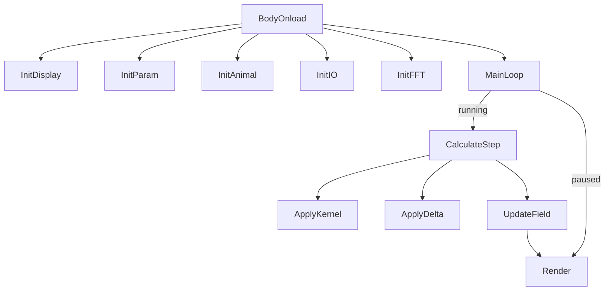

## Initialization flow (short)

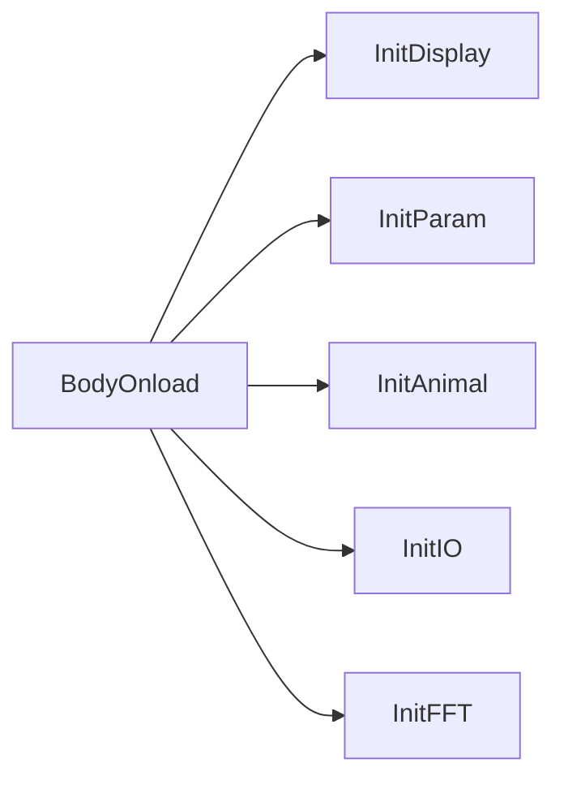

- `InitFFT` computes the kernel FFT once (recompute only if kernel params change).

## Main loop (sequence)

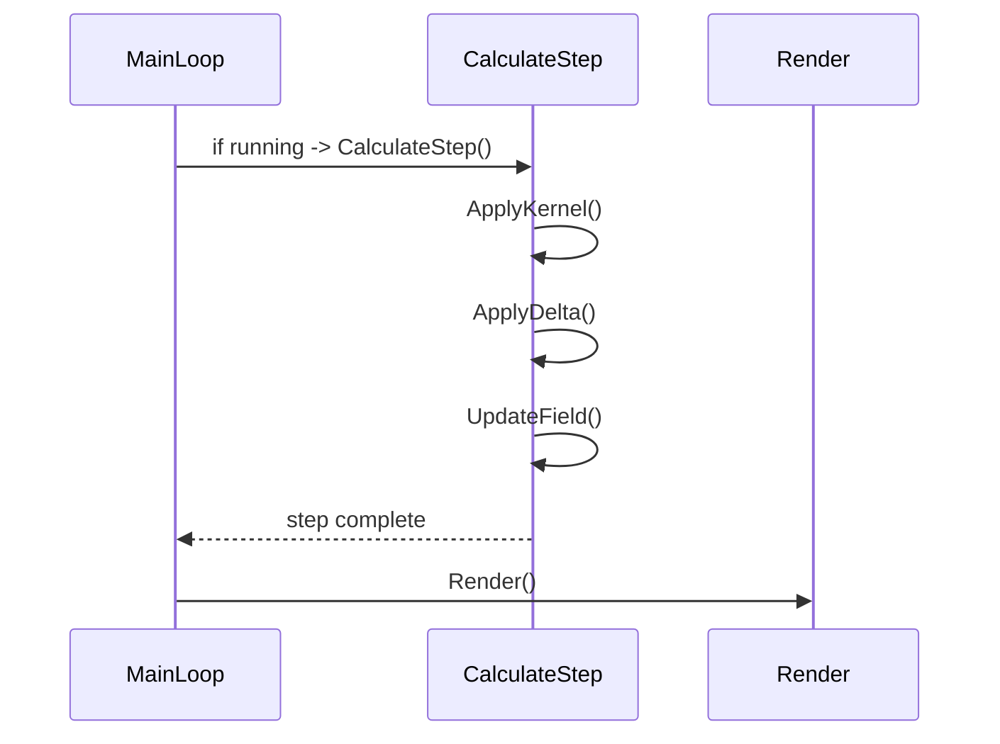

## CalculateStep — flow & pseudocode

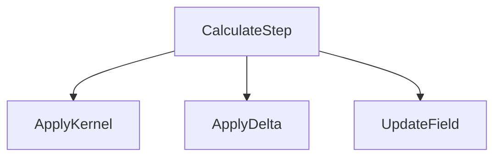

Pseudocode:

```javascript
function CalculateStep(field):
  neighborhood = ApplyKernel(field)
  growth = ApplyDelta(neighborhood)
  field = UpdateField(field, growth)
  return field
```

## ApplyKernel — flow, FFT notes & pseudocode

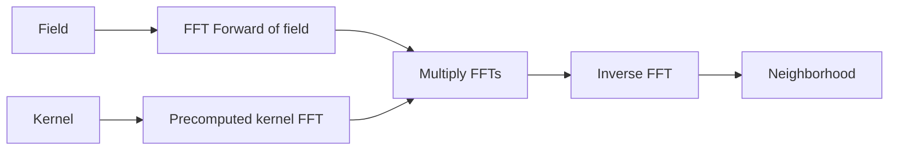

Pseudocode:

```javascript
function ApplyKernel(field):
  complex = FFTForward(field)
  complex *= kernelFFT
  neighborhood = FFTInverse(complex)
  return realPart(neighborhood)
```

Notes:

- FFT implies periodic boundaries.
- Ensure `kernelFFT` is computed on the same grid size and ordering as the field transform.

## ApplyDelta — flow & example

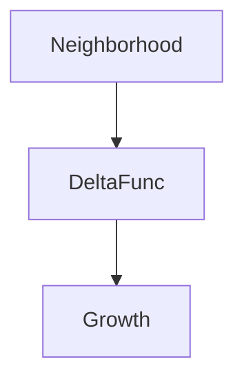

Example mapping:

```javascript
growth = beta * exp(-((n - mu)^2) / (2 * sigma^2))
```

## UpdateField — flow & pseudocode

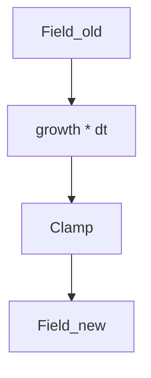

Pseudocode:

```javascript
function UpdateField(field, growth):
  field += dt * growth
  clamp field to [0,1]
  return field
```

## Rendering flow

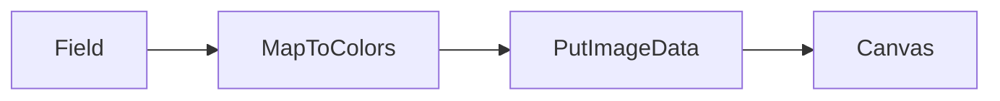

Tip: use a precomputed color palette or lookup table to speed mapping.

## IO / Interaction flow


## Per-function short reference (what to edit)

- `BodyOnload()` — top-level boot, calls initializers and starts the loop.
- `InitDisplay()` — set canvas sizes and UI widgets.
- `InitParam()` — set `R`, `dt`, kernel/delta defaults.
- `InitAnimal()` — initial field presets.
- `InitIO()` — mouse/keyboard bindings.
- `InitFFT()` — prepare FFT buffers and compute `kernelFFT`.
- `CalculateStep()` — main step orchestration.
- `ApplyKernel()` — convolution implementation (FFT multiply).
- `ApplyDelta()` — local growth mapping function.
- `UpdateField()` — integrate growth into the field.
- `RenderCanvas()` / `DrawField()` — visual output.

## Parameters summary (quick)

- `R`: grid resolution.
- `dt`: timestep multiplier.
- `mu`, `sigma`, `beta`: delta curve parameters.
- `kernel_A`, `kernel_B`, `kernel_E`: kernel weights and shaping.

## Dataflow & FFT (compact)

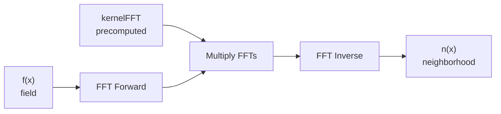

Notes:

- `kernelFFT` is computed once in `CalcKernel()` and reused in every `NextGen()` call.
- Ensure padding, ordering and normalization match between forward and inverse transforms.
- The convolution result `n(x)` is then passed to `DeltaFunc()` to compute growth.

## Glossary

- Field: 2D array of scalar values representing the state.
- Kernel: radial weighting function used in convolution.

## Additional Documented Functions (High Priority)

### `AddRandom(intensity, isFill)` — **populate field with random values**

- Purpose: add random noise to the field, either filling the entire grid or adding to existing cells.
- Parameters:
  - `intensity` (0 to 1): strength of random values to add
  - `isFill` (boolean): true = fill entire grid, false = add to existing cells only
  
- Globals read: `field`, `F_SIZE`, random seed
- Globals written: `field` (populated with random values)
- Effect:

  ```javascript
  if (isFill):
    for each cell (i,j):
      field[i][j] = Random() * intensity
  else:
    for each non-zero cell (i,j):
      field[i][j] += Random() * intensity
      clamp to [0, 1]
  ```

- Impact: used to initialize simulation or inject noise for stability testing.

### `TransformField(dX, dY, dS, dA, flip)` — **translate, rotate, scale, and flip the field**

- Purpose: geometrically transform the field (creature) in place.
- Parameters:
  - `dX`, `dY` (pixels): translation offset
  - `dS` (factor): scale multiplier (1.0 = no change, 2.0 = double size)
  - `dA` (radians): rotation angle
  - `flip` (bitmask): bits for horizontal/vertical/diagonal flip
  
- Globals read/written: `field`, `fieldTx` (temporary)
- Effect:

  ```javascript
  // Create temporary field
  for each new position (i',j') in output:
    // Invert transforms to find source position
    (i,j) = Inverse-Transform(i', j', dX, dY, dS, dA, flip)
    fieldTx[i'][j'] = Interpolate(field, i, j)  // bilinear interpolation
  
  // Copy transformed field back
  field = fieldTx
  ```

- Impact: enables creature manipulation for composition and symmetry analysis.

### `ParseRule(st)` — **extract parameters from rule string**

- Purpose: parse a rule string (e.g., `R.B=1,1,1,coreID=0\nδ0.3,0.08`) into simulation parameters.
- Parameters: `st` (rule string with header and parameter list)
- Globals written: `kernel_B[]`, `kernel_E[]`, `layerID`, `coreID`, `kernel_A`, `delta_c`, `delta_w`, etc.
- Format example: `R.B=1,1,1,1/coreID=0/lID=1/A=4\nC0.35/W0.08`
  - `R` prefix = rule header
  - `B=...` = kernel_B layer weights (up to 4)
  - `coreID=...` = core function shape (0-4)
  - `lID=...` = layer ID
  - `C...` = delta center (mu)
  - `W...` = delta width (sigma)
  
- Effect:

  ```javascript
  split rule string by delimiters
  for each parameter found:
    if name == "B": parse array values → kernel_B[]
    if name == "C": parse float → delta_c
    if name == "W": parse float → delta_w
    ... (and so on for 20+ parameters)
  ```

- Impact: enables reproducible rule sharing and discovery workflow.

### `SetRule(st)` — **apply parsed rule to simulation**

- Purpose: wrapper that parses a rule string and initializes kernel FFT.
- Parameters: `st` (rule string)
- Effect:

  ```javascript
  ParseRule(st)       // extract parameters
  CalcKernel()        // recompute kernel FFT with new params
  ```

- Impact: one-stop function to load a complete rule configuration.

### `ResizeField(s, p, isZoom)` — **resize the grid to new dimensions**

- Purpose: change F_SIZE to a new power of 2 (e.g., 256 → 512).
- Parameters:
  - `s` (new size: 1, 2, 4, 8, ... representing 2^s)
  - `p` (position: 0-3, which quadrant to place scaled creature)
  - `isZoom` (boolean): true = scale values when resizing, false = preserve values
  
- Effect:

  ```javascript
  old_size = F_SIZE
  new_F_SIZE = 2^s
  
  InitAllArrays()     // allocate new arrays at new F_SIZE
  
  if (isZoom):
    scale_factor = new_F_SIZE / old_size
    for each old cell (i,j):
      for each new cell in region:
        new_field[...] = old_field[i][j]  // copy scaled
  else:
    copy old_field into new_field at quadrant p
  ```

- Impact: allows working with different grid resolutions (larger = more detail but slower).

### `CopyField(arr, width, height, format, isShrink)` — **serialize field to various export formats**

- Purpose: convert a 2D array to text representation for clipboard/file export.
- Parameters:
  - `arr` (2D array): field, delta, or neigh to export
  - `width`, `height` (dimensions): array size
  - `format` (0-3): ZIP, TABLE, TEXT, MATLAB
  - `isShrink` (boolean): compress if true
  
- Format options:
  - **ZIP** (format 0): Binary compressed; minimal size, fast transfer
  - **TABLE** (format 1): Tab-delimited ASCII; human-readable rows/columns
  - **TEXT** (format 2): Plain ASCII numbers; largest, slowest
  - **MATLAB** (format 3): MATLAB syntax: `arr = [rows...]`
  
- Effect:

  ```javascript
  if format == ZIP:
    compress non-zero cells → (zip) + base64
  else if format == TABLE:
    output each row separated by tabs
  else if format == TEXT:
    output each value space-separated
  else if format == MATLAB:
    output "arr = [rows with ; between]"
  return serialized string
  ```

- Impact: enables save/load workflow and rule sharing across users.

### `ResizeAll(s, isZoom)` — **resize arrays and canvases together**

- Purpose: wrapper that calls `ResizeField()` and also adjusts canvases/UI when changing grid size.
- Parameters: `s` (new size exponent), `isZoom` (boolean)
- Globals read/written: calls `InitAllArrays()`, updates `F_SIZE`, resizes canvas wrappers via `InitAllCanvas()`.
- Effect:

```javascript
old_size = F_SIZE
F_SIZE = 1 << s
InitAllArrays()
InitAllCanvas()
if (isZoom) { /* scale visual elements */ }
```

### `InitArray()` — **helper: allocate nested arrays**

- Purpose: utility to allocate empty 2D arrays of size `F_SIZE` initialized to 0.
- Parameters: none (uses global `F_SIZE`)
- Effect:

```javascript
arr = new Array(F_SIZE)
for (i=0;i<F_SIZE;i++) { arr[i] = new Array(F_SIZE).fill(0) }
return arr
```

### `ClearField(value=0)` — **clear or fill the main field buffer**

- Purpose: set every cell of `field` to `value` (default 0)
- Parameters: `value` (number)
- Effect:

```javascript
for i in 0..F_SIZE-1:
  for j in 0..F_SIZE-1:
    field[i][j] = value
```

### `TransformFieldOrAdjust(dX, dY, dS, dA, flip)` — **transform wrapper**

- Purpose: apply `TransformField()` or tweak transform parameters depending on UI mode
- Effect: calls `TransformField()` when applying geometric transforms, or updates transient state when adjusting controls.

### `CenterField(isRotate)` — **auto-center creature**

- Purpose: compute centroid via `CalcMoments()` and translate field so centroid is at center of grid. If `isRotate` true, also adjust orientation.
- Effect:

```javascript
CalcMoments(true)
dx = round(F_SIZE/2 - mX)
dy = round(F_SIZE/2 - mY)
TransformField(dx, dy, 1.0, 0, 0)
```

### Random / Seed utilities

`GetNewSeed()` — returns timestamp-based seed for RNG

```javascript
return (new Date).getTime()
```

`UseSeed(seed)` — sets PRNG state using seed

```javascript
lastSeed = seed
init_genrand(lastSeed)
```

`Random()` / `RandomInt(min,max)` / `RandomFloat(min,max)` — wrappers around Mersenne Twister

```javascript
Random() -> genrand_real2()  // [0,1)
RandomInt(min,max) -> floor(Random()*(max+1-min)+min)
RandomFloat(min,max) -> Random()*(max-min)+min
```

### `TrimCells(cells, j1, j2)` — **shrink sparse cell lists**

- Purpose: utility that trims or slices a list of sparse cell coordinates for paste/seed operations.
- Effect: returns subset of `cells` within column range j1..j2 or compresses representation for export.

## Global Variables (Key State)

**Simulation Parameters (tunable by user):**

| Variable | Type | Purpose | Range/Default |
|----------|------|---------|---|
| `F_SIZE` | int | Grid dimensions (power of 2) | 256, 512, 1024 |
| `NS` | int | Kernel radius (cells) | 6-20, default 13 |
| `TS` | int | Time steps per generation | 1-1000, default 10 |
| `delta_c` | float | Delta function center (μ) | [0, 1], default 0.14 |
| `delta_w` | float | Delta function width (σ) | [0.001, 0.5], default 0.015 |
| `kernel_A` | float | Kernel exponent (sharpness) | [0.5, 8], default 4 |
| `kernel_B[]` | float[4] | Layer weights | [0, B_DIV], default [B_DIV,0,0,0] |
| `kernel_E[]` | float[4] | Layer edges | [0, B_DIV] |
| `layerID` | int | Number of kernel rings | 0-3, default 0 (unimodal) |
| `coreID` | int | Kernel shape function | 0-4 (gaussian, poly, trap, step, life-like) |
| `deltaID` | int | Delta profile shape | 0-3 (gaussian, poly, trap, step) |

**Simulation State (runtime):**

| Variable | Type | Purpose |
|----------|------|---------|
| `field[][]` | float[F_SIZE][F_SIZE] | Current population distribution |
| `fieldOld[][]` | float[F_SIZE][F_SIZE] | Previous generation (backup) |
| `neigh[][]` | float[F_SIZE][F_SIZE] | Neighborhood activation (convolution result) |
| `delta[][]` | float[F_SIZE][F_SIZE] | Growth rate per cell (delta function output) |
| `gen` | int | Current generation number |
| `time` | float | Simulation time (continuous, TS-scaled) |
| `isRunning` | boolean | Is simulation active (true) or paused (false) |
| `runGen` | int or null | Remaining generations to run (null = infinite) |

**Kernel & FFT (precomputed):**

| Variable | Type | Purpose |
|----------|------|---------|
| `kernel[][]` | float[F_SIZE][F_SIZE] | Spatial kernel (for visualization) |
| `kernelRe[][]` | float[F_SIZE][F_SIZE] | Kernel real part in frequency domain |
| `kernelIm[][]` | float[F_SIZE][F_SIZE] | Kernel imaginary part in frequency domain |
| `neighRe[][]`, `neighIm[][]` | float[F_SIZE][F_SIZE] | Working buffers for FFT convolution |
| `fieldIm[][]` | float[F_SIZE][F_SIZE] | Field imaginary part (FFT computation) |

**Moments & Statistics (updated per generation):**

| Variable | Type | Purpose |
|----------|------|---------|
| `m00` | float | Total mass (sum of field) |
| `mX`, `mY` | float | Centroid coordinates |
| `axisA`, `axisB` | float | Major/minor axes lengths |
| `ec` | float | Eccentricity (0=circle, 1=line) |
| `th` | float | Orientation angle (radians) |
| `φ1`-`φ7` | float | Hu moment invariants (shape descriptors) |
| `ψ8`-`ψ10` | float | Flusser invariants (scale-invariant) |

**Display & UI Options:**

| Variable | Type | Purpose | Values |
|----------|------|---------|--------|
| `optCenter` | int | Auto-centering mode | 0=OFF, 1=POS, 2=AM, 3=TH |
| `optColor` | int | Heatmap color scheme | 0=gray, 1=heat, 2=viridis, ... |
| `optCalc` | int | Statistics calculation | 0=ALL, 1=STAT, 2=NONE |
| `optCopy` | int | What to copy to clipboard | 0=FIELD_S, 1=FIELD, 2=DELTA, 3=NEIGH, 4=SEED |
| `optFormat` | int | Export format | 0=ZIP, 1=TABLE, 2=TEXT, 3=MATLAB |
| `optRepeat` | int | Pattern repetition mode | 0=OFF, 1=ADD, 2=MIRROR, 3=COLLIDE |
| `optAid` | int | UI aids display | 0=OFF, 1=RULER, 2=TRACE |

## Complete Function Reference (All 127 Functions)

**Core Simulation Functions (heavily documented above):**

| Function | Line | Purpose | Status |
|----------|------|---------|--------|
| `BodyOnload()` | 1263 | Initialization entry point on page load | ✓ Detailed |
| `Step()` | 1306 | Main animation loop frame dispatcher | ✓ Detailed |
| `NextGen(isUpdate)` | 1416 | Core simulation step: FFT convolution + delta mapping + field update | ✓ Detailed |
| `CalcKernel()` | 1390 | Precompute neighborhood kernel and its FFT | ✓ Detailed |
| `InitAllArrays()` | 1011 | Allocate all simulation 2D arrays | ✓ Detailed |
| `InitAllCanvas()` | 1029 | Initialize canvas DOM elements | ✓ Detailed |
| `DeltaFunc(n)` | 520* | Map neighborhood activation to growth | ✓ Detailed |
| `KernelFunc(r)` / `CoreFunc(r)` | 590*,658* | Generate radial kernel weighting | ✓ Detailed |

**FFT & Math Functions (documented):**

| Function | Line | Purpose | Status |
|----------|------|---------|--------|
| `FFT1D(dir, re1, im1)` | 1743 | 1D Fast Fourier Transform | ✓ Detailed |
| `FFT2D(dir, re2, im2)` | 1795 | 2D FFT via row-column decomposition | ✓ Detailed |
| `MatrixDot(ar, ai, br, bi, cr, ci)` | 1815 | Complex multiplication (convolution in frequency domain) | ✓ Detailed |

**Statistics & Visualization (documented):**

| Function | Line | Purpose | Status |
|----------|------|---------|--------|
| `CalcMoments(isCalc)` | 1488 | Compute image moments and Hu invariants | ✓ Detailed |
| `RenderCanvas()` / `DrawField()` | 2869 | Convert arrays to pixel colors on canvas | ✓ Detailed |
| `DrawAllPanels()` | 2997 | Render all 4 display canvases | ✓ Detailed |

**Input Handling (documented):**

| Function | Line | Purpose | Status |
|----------|------|---------|--------|
| `OnKeyDown(e)` | 1210 | Keyboard event dispatcher | ✓ Detailed |
| `OnCopy(e, format)` | 1081 | Serialize state to clipboard | ✓ Detailed |
| `OnPaste(e)` | 1149 | Deserialize state from clipboard | ✓ Detailed |

**Field Manipulation Functions (need documentation):**

| Function | Line | Purpose | Status |
|----------|------|---------|--------|
| `AddRandom(intensity, isFill)` | 1854 | Populate field with random values | ⚠ Brief |
| `TransformField(dX, dY, dS, dA, flip)` | 1883 | Rotate, scale, flip, translate field | ⚠ Brief |
| `TransformFieldOrAdjust()` | 1937 | Transform or adjust parameters | ⚠ Brief |
| `ResizeField(s, p, isZoom)` | 1037 | Resize grid to different dimensions | ⚠ Brief |
| `ResizeAll(s, isZoom)` | 1067 | Resize everything including canvas | ⚠ Brief |
| `ClearField(x)` | 1839 | Clear or initialize field | ⚠ Brief |
| `CenterField(isRotate)` | 2806 | Auto-center creature in grid | ⚠ Brief |
| `TrimCells(cells, j1, j2)` | 2672 | Trim sparse cell list to range | ⚠ Brief |

**Rule & Parameter Functions (need documentation):**

| Function | Line | Purpose | Status |
|----------|------|---------|--------|
| `ParseRule(st)` | 2559 | Parse rule string into parameters | ⚠ Brief |
| `SetRule(st)` | 2614 | Apply rule string to simulation | ⚠ Brief |
| `SetRuleAndAddCells(st, isZoom, isRandom)` | 2644 | Set rule and populate with cells | ⚠ Brief |
| `GetRuleSt()` | 1958 | Export current rule as string | ⚠ Brief |
| `GetMatlabRuleSt()` | 1965 | Export rule in MATLAB format | ⚠ Brief |
| `PresetRule({...})` | 3554 | Load preset rule configuration | ⚠ Brief |
| `PresetAnimal({...})` | 3570 | Load preset animal from catalog | ⚠ Brief |
| `ChangeBeta(b0, b1, b2, ...)` | 3582 | Adjust beta/parameter set | ⚠ Brief |

**Statistics & Analysis Functions (need documentation):**

| Function | Line | Purpose | Status |
|----------|------|---------|--------|
| `CalcStats()` | 1631 | Compute shape statistics | ⚠ Brief |
| `CalcPeriods()` | 1658 | Detect oscillation periods | ⚠ Brief |
| `GetStatVals()` | 1003 | Retrieve current stat values | ⚠ Brief |
| `SelectStat(id)` | 1246 | Select which stat to display | ⚠ Brief |
| `SelectStatObj(obj)` | 1242 | Select stat from UI object | ⚠ Brief |
| `ResetCounters()` | 3197 | Reset all statistics to zero | ⚠ Brief |
| `ResetStat()` | 3234 | Reset specific stat | ⚠ Brief |
| `ShowCounters()` | 3260 | Display statistics in UI | ⚠ Brief |

**Drawing & UI Functions (partially documented):**

| Function | Line | Purpose | Status |
|----------|------|---------|--------|
| `DrawCircle(canvas, x, y, size, color)` | 2830 | Draw filled circle on canvas | ⚠ Brief |
| `FillCircle(canvas, x, y, size, color)` | 2837 | Fill circle (wrapper) | ⚠ Brief |
| `DrawLine(canvas, x1, y1, x2, y2, ...)` | 2844 | Draw line with optional arrow | ⚠ Brief |
| `DrawDirection(canvas, x1, y1, x2, y2, ...)` | 2860 | Draw directional arrow | ⚠ Brief |
| `DrawArray(canvas, arr, scale, isHalf)` | 2869 | Visualize 2D array as heatmap | ⚠ Brief |
| `DrawStatsBar()` | 3025 | Draw statistics bar panel | ⚠ Brief |
| `DrawStatsArc(canvas, which)` | 3097 | Draw stat indicator arc | ⚠ Brief |
| `DrawSwatches()` | 3166 | Draw color swatches | ⚠ Brief |
| `DrawAxis(ctx, ...)` | 3341 | Draw plot axes | ⚠ Brief |
| `DrawGraph(func, id, ...)` | 3348 | Draw mathematical function graph | ⚠ Brief |
| `CopyGraph(id1, id2)` | 3395 | Copy graph between canvases | ⚠ Brief |
| `DrawAllGraphs()` | 3409 | Redraw all graphs | ⚠ Brief |

**Panel & UI Management (need documentation):**

| Function | Line | Purpose | Status |
|----------|------|---------|--------|
| `InitCanvas(id)` | 2819 | Create canvas wrapper object | ⚠ Brief |
| `InitAllStat()` | 3206 | Initialize statistics tracking | ⚠ Brief |
| `ShowPanel(name, isOn)` | 3541 | Toggle UI panel visibility | ⚠ Brief |
| `SwitchPanel(i)` | 3546 | Switch between panel tabs | ⚠ Brief |
| `ShowOptions()` | 3516 | Display options dialog | ⚠ Brief |
| `StatCheckBox()` | 3222 | Handle stat checkbox clicks | ⚠ Brief |
| `ChangeClass(on, off, cond)` | 3508 | Toggle CSS classes | ⚠ Brief |
| `ShowEquation(pre, info, id)` | 3309 | Display equation in UI | ⚠ Brief |
| `ShowCalculation()` | 3316 | Show calculation details | ⚠ Brief |

**Data Format Functions (need documentation):**

| Function | Line | Purpose | Status |
|----------|------|---------|--------|
| `CopyField(arr, width, height, format, isShrink)` | 2721 | Serialize field to various formats | ⚠ Brief |
| `CopyToClipboard(text)` | 2798 | Put text on clipboard | ⚠ Brief |
| `ToZip(v)` / `FromZip(c)` | 2689 | Compress/decompress cell data | ⚠ Brief |
| `IsZip(c)` | 2697 | Detect if data is compressed | ⚠ Brief |
| `ToRepeatSt(d)` / `FromRepeatSt(st)` | 2701 | Encode/decode run-length compression | ⚠ Brief |
| `TextToZip(cellSt, format, shrink)` | 2712 | Convert text format to compressed | ⚠ Brief |

**Plotting & Graphing (need documentation):**

| Function | Line | Purpose | Status |
|----------|------|---------|--------|
| `PlotSurface(arr)` | 3415 | 3D surface plot visualization | ⚠ Brief |
| `PlotLine(isSwitch)` | 3440 | Plot 2D line graph | ⚠ Brief |
| `RefreshPlot()` | 3464 | Redraw current plot | ⚠ Brief |

**Animation & GIF (need documentation):**

| Function | Line | Purpose | Status |
|----------|------|---------|--------|
| `CalcFPS()` | 1333 | Calculate frames per second | ⚠ Brief |
| `DoGIF()` | 3473 | Encode and download field as animated GIF | ⚠ Brief |
| `RepeatAdd(isForce)` | 3487 | Add cell pattern repeatedly | ⚠ Brief |

**Utility & Helper Functions (generally self-explanatory):**

| Function | Line | Purpose | Status |
|----------|------|---------|--------|
| `Round(x)` | 1346 | Round to PRECISION decimals | ✓ Simple |
| `Bound(x, min, max)` | 1347 | Clamp value to range | ✓ Simple |
| `Mod(x, n)` | 1348 | Modulo with positive result | ✓ Simple |
| `IsZero(x)` | 1349 | Check if value is near zero | ✓ Simple |
| `IsEq(x, y)` | 1350 | Check if two values approximately equal | ✓ Simple |
| `IsPos(x)` | 1351 | Check if value is positive | ✓ Simple |
| `IsNeg(x)` | 1352 | Check if value is negative | ✓ Simple |
| `Num(x, n)` | 1354 | Format number with n digits | ✓ Simple |
| `Num2(x)` | 1359 | Format number with 2 decimals | ✓ Simple |
| `SortedKeys(list)` | 1364 | Get sorted keys from object | ✓ Simple |
| `RGBSt(S)` | 1368 | Convert string to RGB color | ✓ Simple |
| `StatRGBSt(part)` | 3019 | Get stat panel color | ✓ Simple |
| `LoadGif(img)` / `UnloadGif(img)` | 1373 | Load/unload GIF image | ⚠ Brief |
| `GetNewSeed()` | 1383 | Generate random seed | ✓ Simple |
| `UseSeed(seed)` | 1384 | Set random seed | ✓ Simple |
| `Random()` | 1385 | Get random float [0,1) | ✓ Simple |
| `RandomInt(min, max)` | 1386 | Get random integer in range | ✓ Simple |
| `RandomFloat(min, max)` | 1387 | Get random float in range | ✓ Simple |
| `InitArray()` | 1832 | Initialize array | ⚠ Brief |
| `GetLayerSt(st)` | 2529 | Extract layer string from rule | ⚠ Brief |
| `ChangeLayer(n)` | 2549 | Adjust layer parameters | ⚠ Brief |
| `TwoPoints(x1, y1, x2, y2, olda)` | 1464 | Distance between two points | ✓ Simple |
| `FindMax(dict, prev)` | 1476 | Find maximum value in dictionary | ✓ Simple |
| `DiluteTime()` | 1972 | Slow down time | ⚠ Brief |
| `ConcentrateTime()` | 1985 | Speed up time | ⚠ Brief |
| `DoAction(key, shift)` | 3620 | Process keyboard action | ⚠ Brief |

**Summary Statistics:**

- **Total Functions**: 127
- **Heavily Documented (✓ Detailed)**: 11 functions
- **Partially Documented (⚠ Brief)**: 70 functions
- **Self-Explanatory (✓ Simple)**: 46 functions

**Next Priority for Documentation:**

1. **Field Manipulation**: `AddRandom()`, `TransformField()`, `ResizeField()` (high impact on user workflow)
2. **Rule & Parameters**: `ParseRule()`, `SetRule()`, `PresetRule()` (essential for understanding parameter space)
3. **Data Formats**: `CopyField()`, `ToZip()`, `TextToZip()` (important for save/load workflow)

- Delta: mapping from neighborhood activation to growth.
- FFT: fast Fourier transform used for efficient convolution.

## Tuning, Debugging & Performance Checklist

- Profile the code in browser devtools; measure time in `ApplyKernel()` and `RenderCanvas()`.
- Ensure `kernelFFT` is recomputed only on kernel parameter changes.
- Reuse typed arrays; avoid per-step allocations.
- If boundary artifacts appear, inspect padding and whether periodicity is intended.

## Extensions and Experiments

- Add multi-scale kernels (different radii with different weights).
- Replace CPU FFT with WebGL/GPU convolution for very large `R`.
- Create an automated parameter sweep and gallery exporter (record GIFs using the existing `InitGIF()` pipeline).

## Next steps I can take for you

- extract exact line numbers for all functions from `Lenia.html` and add a quick-reference table, or
- add concrete code snippets inserted into `Lenia.html` as comments or helper wrappers to make modifying kernels/deltas easier.

---
This expanded document adds explicit diagrams, per-function flows, and practical pseudocode to make the codebase easier to understand and modify. Tell me which next step you'd like me to take (line references or code examples) and I will proceed.
